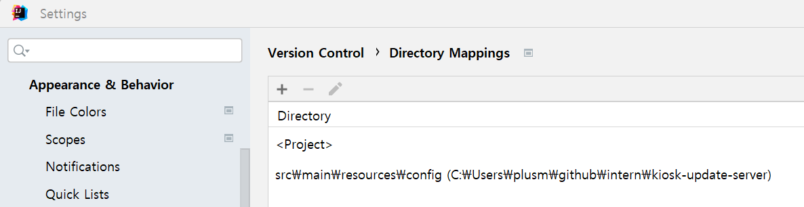

# kiosk-update-server-sub

[kiosk-update-server] 배포 관련 설정 업데이트 레포입니다.


# kiosk-update-server 내 설정
### 서브모듈 생성
```
git submodule add https://github.com/moki-develop-team/kiosk-update-server.git src/main/resources/config
```
### .gitignore
 .gitignore에 src/main/resources/setting 추가

# 사용 방법
### 1. git bash로 실행
```
git submodule update --remote
```

### 2. 인텔리제이로 실행
[참고 자료](https://velog.io/@9pruruluru2/Spring-boot%EC%9D%98-%EB%AF%BC%EA%B0%90-%EC%A0%95%EB%B3%B4application.yml%EC%9D%84-%EC%86%90%EC%89%BD%EA%B2%8C-%EA%B4%80%EB%A6%AC%ED%95%98%EB%8A%94-%EB%B0%A9%EB%B2%95feat.-submodule)
1. intellij -> settings -> 버전관리 -> 디렉토리 매핑
2. `+`눌러 resources/config 주소 추가
